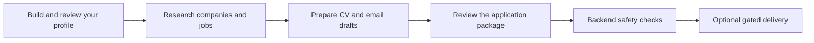

# Auto Initiativ

**Turn a verified career profile into researched, reviewable job applications.**

Auto Initiativ is a local-first job-search workspace. It helps a candidate build a master CV, discover relevant companies and vacancies, and prepare tailored CVs and outreach drafts in one place.

The engineering idea: let AI do research and drafting, while application code owns facts, workflow state, approvals, and sending. Personal claims must trace back to the candidate's approved profile.

## How it works



- **Profile once, reuse deliberately.** Conversational onboarding and a master CV provide approved claims for later applications.
- **Research with evidence.** Campaigns collect company and vacancy information, sources, fit assessments, and review flags.
- **Prepare applications.** Tailored CV documents and email drafts are assembled into reviewable packages.
- **Stay in control.** The dashboard exposes workflow progress, review exceptions, approvals, and audit history. Sending is disabled by default.

## Engineering highlights

| Concern | Implementation |
| --- | --- |
| AI trust boundary | Restricted Pi RPC workers produce files; JSON Schema validation precedes backend import. |
| Factual grounding | Personal claims reference approved master CV claim IDs. Missing evidence requires review. |
| Durable work | Database-backed tasks, leases, stable execution keys, bounded retries, and recovery for uncertain launches. |
| Workspace isolation | User-scoped data and authorization, with separate PostgreSQL concurrency tests. |
| Controlled side effects | Frozen approval snapshots, deterministic policy and dedupe checks, transactional reservations, and audit records. |
| Reviewable architecture | Versioned workflow definitions and architecture decision records explain boundaries and tradeoffs. |

**Stack:** Python / FastAPI / SQLModel / Alembic; React / TypeScript / Vite; PostgreSQL for durable deployments, SQLite for local exploration; pytest and Playwright.

## Run locally

Requirements: Python 3.12, `uv`, and Node.js 22 with npm. Run from the repository root:

```sh
uv sync --locked --python 3.12 --extra test
npm ci
npm run build
```

On a fresh checkout, copy `.env.example` to `.env` (`cp .env.example .env` on macOS/Linux, `Copy-Item .env.example .env` in PowerShell). Keep an existing `.env` if you already have local configuration.

```sh
uv run alembic upgrade head
uv run uvicorn backend.app.main:app --host 127.0.0.1 --port 8000
```

Open **[the dashboard](http://127.0.0.1:8000/dashboard)**. The example configuration creates a local demo identity, disables the background worker, and keeps email sending off. You can inspect the interface and local account flow without Google credentials or an AI provider. On Windows, use `npm.cmd` if PowerShell blocks `npm.ps1`.

### Enable research and drafting

AI features require an installed, authenticated `pi` executable with access to the configured provider and models. Configuration lives in [config.py](backend/app/core/config.py), and workload defaults in [agent_models.py](backend/app/core/agent_models.py). Set `WORKFLOW_WORKER_ENABLED=true` in your local `.env` and restart after configuring the runtime. Provider access is separate from installing this repository; the demo does not simulate AI results.

Local-first describes where application state lives. AI features and research can send approved inputs to external providers. Use fictional data for public demonstrations.

### Development

```sh
uv run pytest --basetemp artifacts/pytest-temp
npm run typecheck
npm run build
```

The backend serves the built frontend. Rebuild after frontend edits and restart the backend to verify the served version. Live Playwright scenarios in `tests/` require a running app and a disposable local workspace.

PostgreSQL tests need a **disposable** database set through `POSTGRES_TEST_DATABASE_URL`; they skip when it is absent. See [CONTRIBUTING.md](CONTRIBUTING.md) for commands and test boundaries.

## Status and limitations

This is an actively developed portfolio project, not a hosted service. Onboarding, research, drafting, review, and a gated Gmail adapter are implemented. Real delivery needs explicit backend configuration and approval; agents never send mail.

The research graph is currently shadow-observed: the existing workflow engine remains authoritative. Application preparation and privileged sending graph definitions describe validated boundaries, not a generic dispatcher. See [ADR-0003](adr/0003-application-owned-workflow-graph.md) and [shadow-readiness evidence](docs/WORKFLOW_GRAPH_SHADOW_READINESS.md).

The local demo disables authentication and must stay bound to `127.0.0.1`. Shared deployments require authentication and per-user credentials. This repository does not claim a production security audit.

## Explore the code

| Path | Start here for |
| --- | --- |
| [backend/app/workflow/](backend/app/workflow/) | Task execution, graph definitions, recovery, and shadow comparison |
| [backend/app/agents/](backend/app/agents/) | Restricted research and drafting runtimes |
| [backend/app/gates/](backend/app/gates/) | Deterministic evaluation and send reservation |
| [backend/app/imports/](backend/app/imports/) | Validation and normalization of agent output |
| [frontend/src/](frontend/src/) | Dashboard and master CV interface |
| [schemas/](schemas/) | JSON contracts |
| [backend/tests/](backend/tests/) | Safety, isolation, workflow, and integration tests |

For a technical walkthrough, read the [architecture](docs/ARCHITECTURE.md), [agent boundaries](docs/AGENT_BOUNDARIES.md), and [safety gates](docs/SAFETY_GATES.md). The [implementation plan](docs/IMPLEMENTATION_PLAN.md) records project progress.

## Privacy and third-party code

Credentials, databases, CVs, run outputs, and real-account screenshots belong outside Git. Read [SECURITY.md](SECURITY.md) before sharing a checkout or reporting an issue.

CV templates include MIT-licensed upstream material; its [license](third_party/yanliudesign-resume-builder-skill/LICENSE) and [attribution](backend/assets/master_cv/THIRD_PARTY_NOTICES.md) are preserved. No project-wide license has been granted for the original application code.
